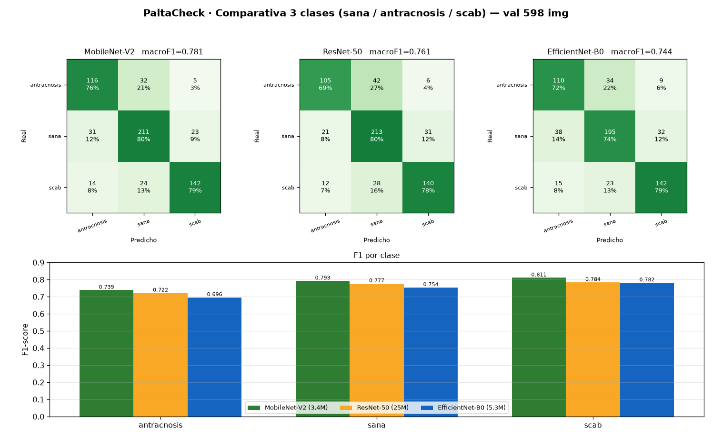
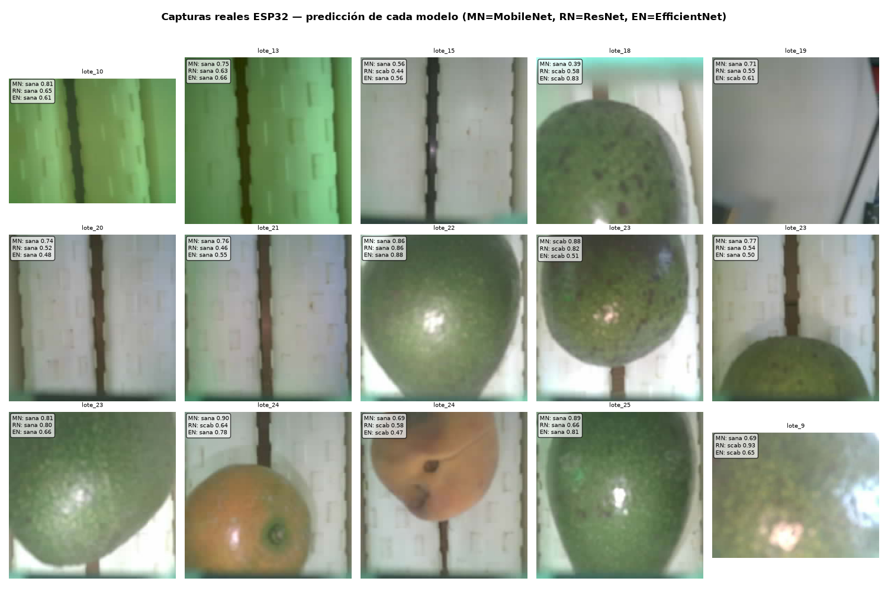
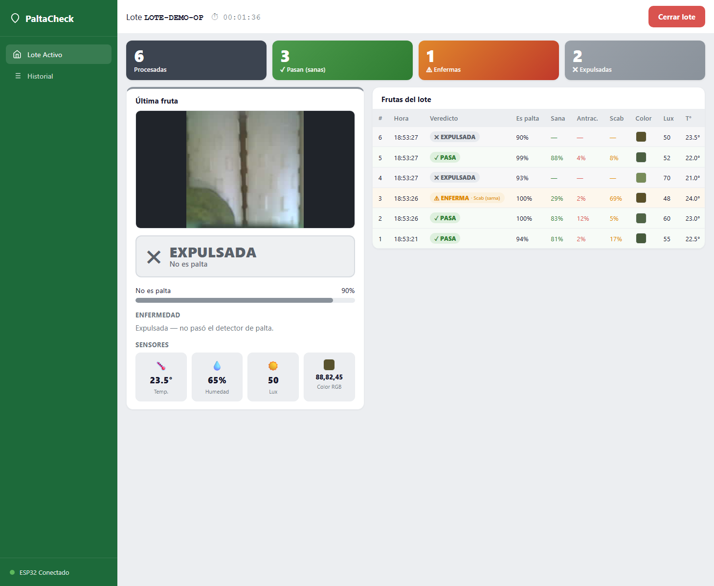

# PaltaCheck — Reporte de integración del clasificador de antracnosis

**Fecha:** 2026-07-05 · **Autor de los modelos:** PieroCM
**Alcance:** entrenar un clasificador de enfermedad de 3 clases, elegir el mejor, meterlo
al backend detrás del gate palta/no‑palta, y rediseñar el dashboard para un operario.

---

## 1. Resumen ejecutivo

Se reemplazó el clasificador de enfermedad (Keras, malogrado) por un modelo **PyTorch →
ONNX de 3 clases** (`sana / antracnosis / scab`) corriendo con **onnxruntime** en el
backend, **manteniendo** el gate binario `palta / no_palta` (Keras) que decide la
expulsión. El backend ahora entrega veredictos reales que el firmware ESP32 lee, y el
dashboard se rehízo para mostrar al operario **solo lo esencial**.

**Cadena de decisión (backend):**

```
foto ESP32 ──► GATE Keras (palta/no_palta) ──► no_palta ─► "no_es_palta"  ► SERVO EXPULSA
                        │
                        └─ palta ─► ENFERMEDAD ONNX (sana/antracnosis/scab)
                                       ├─ sana        ► "sana"        ► PASA
                                       ├─ antracnosis ► "antracnosis" ► ENFERMA
                                       └─ scab        ► "scab"        ► ENFERMA
```

**Modelo elegido:** **MobileNet‑V2** (mejor F1 de validación y mejor comportamiento en
capturas reales; además el más liviano: 8.5 MB ONNX).

---

## 2. Parte 1 — Entrenamiento y export a ONNX

Se entrenaron 3 arquitecturas (transfer learning ImageNet, 2 fases, AMP, RTX 4060) sobre
el dataset de estudio **degradado** para parecerse a la cámara OV2640 (se afinó el blur:
`BLUR_KERNELS (3,5)→(11,13)` para acercar la nitidez a la de las capturas reales).

**Resultados de validación (598 imágenes):**

| Arquitectura | Params | Macro F1 |
|---|---|---|
| **MobileNet‑V2** ⭐ | 3.4 M | **0.781** |
| ResNet‑50 | 25 M | 0.761 |
| EfficientNet‑B0 | 5.3 M | 0.744 |



**Hallazgo:** las dos enfermedades **casi no se confunden entre sí** (antracnosis↔scab
≈ 18–24 casos de 598). El error dominante es **enferma → sana** (falso negativo), sobre
todo antracnosis (~21 % se fuga a sana). "Más grande no es mejor": el liviano MobileNet‑V2
gana. Sin sobreajuste.

**Export ONNX** (`ml_antracnosis/export_todos.py`): los 3 `.pt` → `.onnx` (opset 17),
verificados con onnxruntime; salida `(1,3)` = 3 logits, y los logits ONNX ≈ PyTorch
(diff `~1e-5`). Orden de clases del modelo: **`[antracnosis, sana, scab]`** (alfabético).

---

## 3. Parte 2 — Validación sobre capturas REALES del ESP32

Se corrieron los 3 modelos sobre las **558 capturas reales** (`data/capturas/`), que **no
tienen etiqueta** → análisis distribucional (no accuracy).

| Modelo | sana | scab | antracnosis | Conf. media | Veredicto |
|---|---|---|---|---|---|
| MobileNet‑V2 | 82.4 % | 16.8 % | 0.7 % | **0.78** | reparte OK |
| ResNet‑50 | 59.9 % | 39.6 % | 0.5 % | 0.64 | reparte OK |
| EfficientNet‑B0 | 86.6 % | 13.3 % | 0.2 % | 0.64 | ⚠ colapsa a sana |



**Hallazgos clave:**
- El colapso temido ("todo antracnosis") **no ocurrió**. En cambio, **antracnosis casi
  no dispara** en la cámara real (sub‑detección) — coherente con la fuga vista en validación.
- **Muchas capturas son fondo de cinta vacío** → el gate palta/no‑palta las filtra como
  `no_es_palta` (correcto). Por eso el gate es imprescindible **antes** de la enfermedad.
- **MobileNet‑V2** es el más confiable y no colapsa → **recomendado para el backend**.

---

## 4. Parte 3 — Integración en el backend

Gate Keras intacto; etapa 2 reescrita a ONNX. Preprocesado del ONNX (idéntico al
entrenamiento): **resize 224 BILINEAR → [0,1] → normalize ImageNet → NCHW**; softmax sobre
logits; clases `[antracnosis, sana, scab]` leídas de un JSON (fuente de verdad).

**Verificado en Docker (logs `[ML]`):**
```
[ML] Gate binario (Keras) cargado: /app/models/best_model.keras
[ML] Modelo enfermedad (ONNX) cargado: /app/models/modelo_antracnosis.onnx | clases=['antracnosis','sana','scab']
```
Prueba end‑to‑end: `POST /api/captura/foto` devuelve `clasificacion` **top‑level** (la lee
el firmware) y persiste en la BD `clasificacion`, `confianza`, `confianza_gate`,
`probabilidades` (JSONB `{sana,antracnosis,scab}`) y `votos_scab`. El preprocesado del
backend reproduce PyTorch **10/10** (diff `2.7e‑6`).

**Cambios:**
- `backend/inference.py` — etapa 2 con onnxruntime (gate Keras sin tocar).
- `backend/main.py` — voto a 4 clases (+scab), persistir real, devolver `clasificacion`
  top‑level, KPIs rechazadas = antracnosis+scab, **quitado el placeholder `'sana'/0.5`**.
- `backend/models.py` + `db/init.sql` + `backend/database.py` — columnas nuevas
  (`votos_scab`, `confianza_gate`, `probabilidades`) + CHECK con `'scab'` + **ALTER TABLE
  idempotente** (no pierde datos).
- `backend/requirements.txt` — `+onnxruntime` (tensorflow‑cpu se queda para el gate).
- `docker-compose.yml` — `DISEASE_ENABLED=true`, `BINARY_MODEL_PATH`, `DISEASE_MODEL_PATH`,
  `DISEASE_CLASSES_PATH`; `models/modelo_antracnosis.onnx` montado en `/app/models`.

---

## 5. Parte 4 — Dashboard de operario

Se rehízo `frontend/src/views/LoteActivo.vue` para mostrar **solo lo esencial por fruta**
y ocultar todo lo técnico.



**Muestra:** contadores PASA / ENFERMA / EXPULSADA; panel "última fruta" con foto,
**veredicto grande** (PASA verde · ENFERMA·Antracnosis rojo · ENFERMA·Scab ámbar ·
EXPULSADA gris), **"Es palta"** con confianza del gate en %, desglose de **enfermedad**
(sana/antracnosis/scab %), y **sensores** (RGB + swatch, lux, temperatura, humedad); y una
**tabla por fruta** con nº secuencial.

**Oculta:** rutas de archivo/`foto_ruta`, ids internos, votos, chips de estado, tasa de
rechazo, velocidad/sparklines, salud del sistema, y el **historial con datos mock**
(eliminado; Historial ahora solo muestra lotes reales, y se quitó Configuración).

**Colores:** verde=sana, rojo=antracnosis, ámbar=scab (etiqueta distinta), gris=expulsada.
Se conservó abrir/cerrar lote y el contador.

---

## 6. Cómo correr y verificar

```bash
# Backend + BD + Frontend
docker compose up -d --build

# Dashboard del operario
http://localhost:5173

# Probar el modelo con una foto suelta (sin BD)
curl -s --data-binary @foto.jpg -H "Content-Type: image/jpeg" \
     http://localhost:8000/api/modelo/probar
```
Reentrenar / re‑exportar (opcional):
```bash
cd ml_antracnosis && .\.venv\Scripts\activate
python train.py --arch mobilenet_v2      # entrena
python export_todos.py                   # exporta los 3 a ONNX
python validar_capturas.py               # valida sobre capturas reales
```

---

## 7. Hallazgos y recomendaciones

1. **Antracnosis sub‑detecta en la cámara real** (se va a sana). Es el riesgo principal
   (deja pasar fruta enferma). Opciones: bajar el umbral hacia "enferma", recolectar unas
   pocas capturas reales **etiquetadas** de antracnosis para medir recall, o reforzar la
   degradación/dominio en el reentrenamiento.
2. **El gate palta/no‑palta es esencial**: sin él, la cinta vacía se colaría como "sana".
3. **`palta.confianza` = fracción de votos** de las 3 fotos (consenso), no la softmax del
   modelo — esa queda guardada aparte en `probabilidades` + `confianza_gate`. Se puede
   cambiar a la softmax con un ajuste de una línea si se prefiere.
4. El firmware **no se tocó**; lee `clasificacion` top‑level y expulsa `no_es_palta`.

---

## 8. Artefactos nuevos

| Ruta | Qué es |
|---|---|
| `ml_antracnosis/outputs/<arch>/mejor_modelo.pt` | pesos entrenados (3 arqs) |
| `ml_antracnosis/outputs/<arch>/modelo_antracnosis.onnx` | export ONNX |
| `ml_antracnosis/export_todos.py` | exportar los 3 a ONNX + verificar |
| `ml_antracnosis/validar_capturas.py` | validar sobre capturas reales |
| `models/modelo_antracnosis.onnx` + `..._classes.json` | modelo servido al backend |
| `docs_reporte/*.png` | figuras de este reporte |
