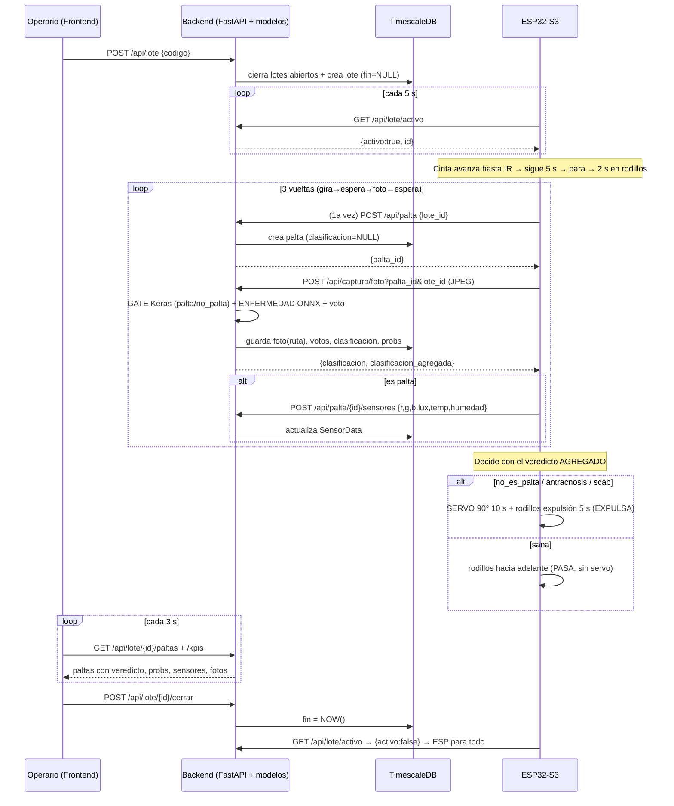

# PaltaCheck — Flujo completo del sistema

**De inicio de lote → ESP32 → fin de procesado de una palta.**
Fecha: 2026-07-07

---

## 1. Actores del sistema

| Actor | Rol |
|---|---|
| **Frontend** (Vue 3, `:5173`) | El operario abre/cierra el lote y ve los resultados en vivo. |
| **Backend** (FastAPI, `:8000`) | Recibe fotos/datos del ESP32, **corre los modelos**, vota, decide el veredicto y persiste en la BD. |
| **ESP32-S3** (firmware) | Mueve cinta/rodillos/servo, saca fotos, lee sensores, **lee el veredicto** del backend y acciona la compuerta. |
| **BD** (TimescaleDB/PostgreSQL, `:5433`) | Guarda lotes, paltas, veredictos y lecturas de sensores. |

> El modelo **corre en el backend**, no en el ESP32. El micro solo captura y obedece.

---

## 2. Diagrama de secuencia

---

## 3. Paso a paso

### Fase A — Inicio del lote (operario)
1. El operario entra a **http://localhost:5173**, escribe un código y pulsa **"Abrir nuevo lote"**.
2. Frontend → `POST /api/lote {codigo}`. El backend **cierra cualquier lote remanente** (para que nunca haya dos activos) y crea el lote con `fin = NULL`.
3. A partir de aquí `GET /api/lote/activo` responde `{activo:true, id, codigo}`.

### Fase B — El ESP32 detecta que hay lote (polling)
4. En su `loop()`, el ESP32 llama `GET /api/lote/activo` cada ~5 s.
   - Si **no** hay lote activo → `detenerTodo()` y espera (línea quieta, es normal).
   - Si **sí** hay lote → arranca el ciclo de la fruta.

### Fase C — Cinta y posicionamiento de la fruta
5. **`cintaHastaDetectar()`**: la cinta avanza hasta que el sensor **IR** detecta la fruta (`LOW`, con *debounce* de 60 ms).
6. Al detectar, la cinta **sigue 5 s más** (`tiempoCintaExtra`) para que la fruta **caiga a los rodillos**, y **recién ahí se detiene**.
7. **2 s** de espera con la fruta ya en los rodillos (`tiempoEnRodillos`).

### Fase D — 3 vueltas (captura + clasificación)
Se repite **3 veces** (`cantidadVueltas`), cada vuelta con la secuencia **GIRA → ESPERA → FOTO → ESPERA**:

8. **GIRA** ambos rodillos 4 s (`tiempoGiroRodillos`) → la fruta rota para ver otra cara.
9. **ESPERA** 2 s (`tiempoAntesFoto`) → se asienta, foto sin movimiento.
10. **FOTO**: `capturarFresca()` toma un frame nuevo (descarta 2 buffers viejos).
11. **1ª vuelta**: crea la palta con `POST /api/palta {lote_id}` (sin sensores todavía) → obtiene `palta_id`. Las 3 fotos van a **la misma** `palta_id`.
12. Sube la foto: `POST /api/captura/foto?palta_id&lote_id` con el **JPEG crudo**. El backend:
    - Corre el **GATE** (Keras `palta/no_palta`).
    - Si es palta, corre el **modelo de ENFERMEDAD** (ONNX `sana/antracnosis/scab`).
    - **Vota** entre las fotos y actualiza `palta.clasificacion`.
    - Responde `{clasificacion (de esta foto), clasificacion_agregada (voto)}`.
13. **Gate por vuelta** (eficiencia): el ESP32 lee el veredicto de **esta** foto:
    - **Si es palta** → lee **TCS34725** (RGB/lux) y **DHT22** (temp/humedad) y los manda con `POST /api/palta/{id}/sensores`.
    - **Si NO es palta** → **omite** sensores y enfermedad (no se promedia lo que no es palta).
14. **ESPERA** 2 s (`tiempoDespuesFoto`) antes de la siguiente vuelta.

### Fase E — Decisión (fin de la palta)
15. Tras las 3 vueltas, el ESP32 usa el **veredicto AGREGADO** (`clasificacion_agregada`, el voto del backend sobre las 3 fotos):

    | Veredicto agregado | Acción física |
    |---|---|
    | `sana` | **PASA** — rodillos hacia adelante, **sin servo** |
    | `antracnosis` | **EXPULSA** — servo 90° por 10 s + rodillos de expulsión 5 s |
    | `scab` | **EXPULSA** — igual |
    | `no_es_palta` | **EXPULSA** — igual |
    | *(sin respuesta de red)* | **PASA** — no rechaza fruta buena por un bache |

16. `esperarLiberacionIR()` espera a que la fruta salga del IR y el ciclo vuelve a empezar con la siguiente.

### Fase F — Visualización (operario)
17. El dashboard hace *polling* cada 3 s: `GET /api/lote/{id}/paltas` y `/kpis`, y muestra por fruta: **veredicto** (PASA/ENFERMA/EXPULSADA), **"es palta" %**, **probabilidades por clase**, **sensores**, la **foto** (y las 3 del ciclo), y el **pie de distribución del lote**.

### Fase G — Cierre del lote
18. El operario pulsa **"Cerrar lote"** → `POST /api/lote/{id}/cerrar` (`fin = NOW()`).
19. En el siguiente poll, el ESP32 recibe `{activo:false}` y **detiene todo**.

---

## 4. Tiempos por fruta (constantes tunables en el firmware)

| Constante | Valor | Qué controla |
|---|---|---|
| `tiempoCintaExtra` | 5000 ms | Cinta sigue tras detectar IR |
| `tiempoEnRodillos` | 2000 ms | Espera inicial en rodillos |
| `tiempoGiroRodillos` | 4000 ms | Giro por vuelta |
| `tiempoAntesFoto` | 2000 ms | Espera antes de la foto |
| `tiempoDespuesFoto` | 2000 ms | Espera antes de la siguiente vuelta |
| `tiempoServoArriba` | 10000 ms | Compuerta arriba (expulsión) |
| `tiempoExpulsion` | 5000 ms | Rodillos de expulsión |
| `cantidadVueltas` | 3 | Fotos por fruta |

**Ciclo aproximado por fruta:** ~2 s + 3 × (4 + 2 + 2) s ≈ **26 s** + expulsión (~15 s si aplica).

---

## 5. Notas de robustez del flujo
- **`dormirVigilando()`**: todas las esperas chequean el lote cada 800 ms; si el lote se cierra a mitad, **frena todo** de inmediato.
- **Sin respuesta del backend** → NO se expulsa (fail-safe: no rechazar fruta buena por red).
- **Fotos por palta**: cada foto se guarda con nombre único (microsegundos) en `capturas/lote_{id}/palta_{id}_*.jpg`; el dashboard lista solo las de esa palta (por lote + fecha) → no se mezclan entre frutas/lotes.
